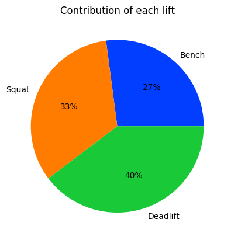
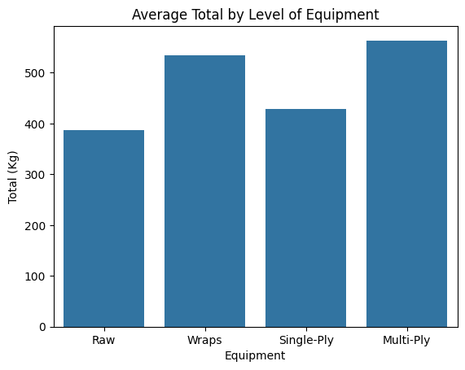
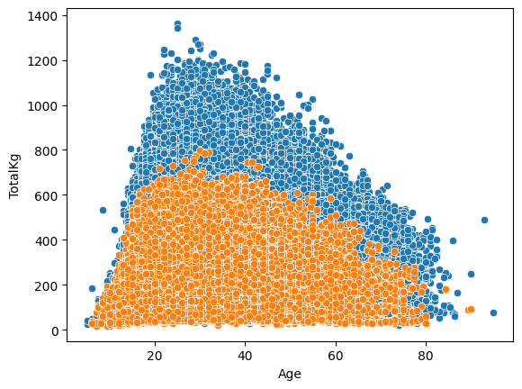

# powerlifting-analysis

> 386,414 meet entries. Three questions. Deadlift wins.

EDA on the OpenPowerlifting dataset from Kaggle. Clean the duplicates and DQs, drop the mostly-empty 4th-attempt columns, then answer three things: which lift carries the total, how much equipment matters, and what age peaks.

## Cleaning

| Step                             | Effect                |
|:---------------------------------|:----------------------|
| Raw rows                         | 386,414               |
| Duplicates                       | 0.14% dropped         |
| Disqualifications (`Place == DQ`)| dropped               |
| Columns dropped                  | `Squat4Kg`, `Bench4Kg`, `Deadlift4Kg`, `Place` |

## Q1 — what carries the total

Deadlift 40%, squat 33%, bench 27%.

## Q2 — does equipment matter

Raw averages ~390 kg total. Multi-ply averages ~565 kg. Wraps beat single-ply, which is a bit of a surprise.

## Q3 — what age is strongest

For both sexes the heaviest totals cluster in the mid-to-late twenties. Drop is gradual after.

## Stack

python · pandas · seaborn · matplotlib · jupyter
